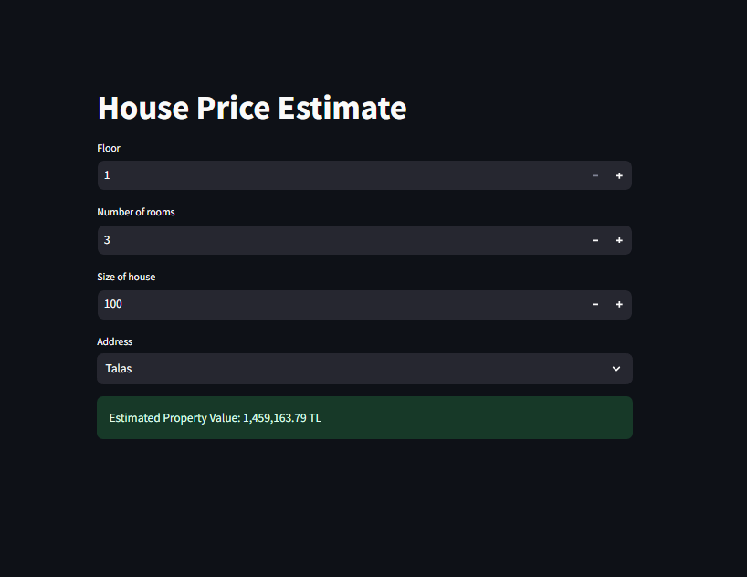
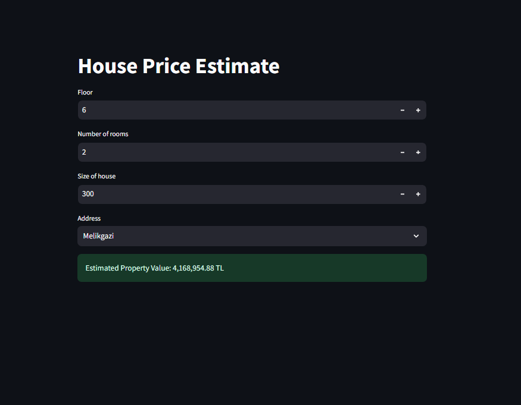

# ML-House-Price-Estimate-App

The project consists of three pages:

1. **Scraping**:

   - Finds the number of pages to scrape
   - Scrapes data from website.

2. **Algorithm**:

   - Cleaning the captured data.
   - Separation of prediction and test data.
   - Testing Random Forest Regressor, Linear, Ridge Regression, LASSO Regression, Elastic Net Regression, Decision Tree Regressor and Gradient Boosting Regressor models.
   - Extracting the selected model using joblib

3. **Streamlit**:

   - Serving the selected model with streamlit

## Screenshots

